# 02 - 系统架构

## 整体架构

StickyNote 采用 **管理器模式（Manager Pattern）** 的桌面应用架构，以 `StickyNoteManager` 为核心控制器，统一管理便签实例、功能模块和系统资源。

```mermaid
graph TB
    subgraph 应用入口
        main[main.py - 入口函数]
    end

    subgraph 核心层
        SM[StickyNoteManager<br/>应用管理器]
        SN[StickyNote<br/>便签窗口类]
        SD[SettingsDialog<br/>设置对话框]
        CFG[ConfigManager<br/>统一配置管理]
        LOG[Logger<br/>统一日志系统]
    end

    subgraph 功能模块层
        SEARCH[SearchManager<br/>搜索功能]
        BACKUP[BackupManager<br/>备份管理]
        SCUT[ShortcutManager<br/>全局快捷键]
        POS[WindowPositionManager<br/>智能定位]
        UR[UndoRedoManager<br/>撤销重做]
        FMT[ContentFormatter<br/>内容格式化]
        TAG[TagManager<br/>标签分组]
        REM[ReminderManager<br/>定时提醒]
        TPL[TemplateManager<br/>模板系统]
        LINK[NoteLinkManager<br/>便签链接]
        RICH[RichTextActions<br/>富文本工具栏]
        MD[MarkdownRenderer<br/>Markdown渲染]
        IMG[ImageHandler<br/>图片处理]
        ENC[NoteEncryption<br/>数据加密]
        PDF[PDFExporter<br/>PDF导出]
        IMPEXP[ImportExportDialog<br/>导入导出]
        UPD[UpdateChecker/Downloader<br/>自动更新]
    end

    subgraph 插件系统
        PREG[PluginRegistry<br/>插件注册表]
        PLOAD[PluginLoader<br/>插件加载器]
        PAPI[PluginAPI<br/>插件接口]
        PLUGINS[plugins/ 目录<br/>字数统计/番茄钟/天气]
    end

    subgraph 云同步
        SYNCENG[SyncEngine<br/>同步引擎]
        WEBDAV[WebDAVClient<br/>WebDAV客户端]
        LOCALSYNC[LocalSyncClient<br/>本地同步]
        CONFLICT[ConflictResolver<br/>冲突解决]
    end

    subgraph 数据层
        NOTES[notes/ - JSON便签文件]
        SETTINGS[settings.json - 应用配置]
        POSITIONS[window_positions.json - 窗口位置]
        TAGS[tags.json - 标签数据]
        LINKS[links_index.json - 链接索引]
        BACKUPS[backups/ - 备份压缩包]
    end

    subgraph 主题层
        STYLES[styles/ - 10个CSS主题文件]
    end

    main --> SM
    SM --> SN
    SM --> SD
    SM --> CFG
    SM --> SEARCH
    SM --> BACKUP
    SM --> SCUT
    SM --> POS
    SM --> TAG
    SM --> REM
    SM --> TPL
    SM --> LINK
    SM --> PREG
    SM --> PLOAD
    SM --> UPD
    SN --> UR
    SN --> FMT
    SN --> RICH
    SN --> MD
    SN --> IMG
    SN --> ENC
    SN --> PDF
    SN --> NOTES
    SN --> STYLES
    SM --> IMPEXP
    SM --> SYNCENG
    PLOAD --> PLUGINS
    SYNCENG --> WEBDAV
    SYNCENG --> LOCALSYNC
    SYNCENG --> CONFLICT
    SM --> SETTINGS
    SM --> POSITIONS
    SM --> TAGS
    SM --> LINKS
    BACKUP --> BACKUPS
```



## 目录结构

```
bianqian_windows/
├── main.py                      # 程序入口（单实例检测 + 信号处理）
│
├── core/                        # 核心模块
│   ├── __init__.py              #   路径工具 + 版本号 (__version__)
│   ├── config.py                #   ConfigManager 单例配置管理器
│   ├── logger.py                #   统一日志系统（RotatingFileHandler）
│   ├── manager.py               #   StickyNoteManager 应用管理器
│   ├── note.py                  #   StickyNote 便签窗口 + PlainLineEdit/TextEdit
│   └── settings.py              #   SettingsDialog 设置对话框（6个标签页）
│
├── features/                    # 功能模块
│   ├── __init__.py              #   模块元信息
│   ├── search.py                #   搜索功能 (SearchManager, SearchDialog)
│   ├── backup.py                #   备份管理 (BackupManager, BackupDialog)
│   ├── shortcuts.py             #   快捷键管理 (ShortcutManager)
│   ├── positioning.py           #   智能定位 (WindowPositionManager)
│   ├── undo_redo.py             #   撤销重做 (UndoRedoManager, UndoRedoLineEdit)
│   ├── formatter.py             #   内容格式化 (ContentFormatter, SmartTextEdit)
│   ├── richtext.py              #   富文本工具栏 (RichTextActions)
│   ├── markdown_renderer.py     #   Markdown 渲染 (MarkdownRenderer)
│   ├── image_handler.py         #   图片处理 (ImageHandler)
│   ├── tag.py                   #   标签分组 (TagManager, TagChipWidget, TagEditDialog)
│   ├── reminder.py              #   定时提醒 (ReminderManager, ReminderDialog)
│   ├── template.py              #   模板系统 (TemplateManager, TemplateDialog)
│   ├── linking.py               #   便签链接 (NoteLinkManager)
│   ├── encryption.py            #   数据加密 (NoteEncryption, AES-256-GCM)
│   ├── lock_dialog.py           #   密码锁定对话框
│   ├── pdf_exporter.py          #   PDF 导出 (PDFExporter)
│   ├── import_export.py         #   导入导出 (ImportExportDialog)
│   ├── sync_dialog.py           #   云同步对话框
│   ├── updater.py               #   自动更新 (UpdateChecker/Downloader/Dialog)
│   ├── plugin_system/           #   插件系统子包
│   │   ├── __init__.py
│   │   ├── base.py              #     PluginBase 插件基类
│   │   ├── registry.py          #     PluginRegistry 注册表
│   │   ├── loader.py            #     PluginLoader 加载器
│   │   └── api.py               #     PluginAPI 插件接口
│   └── sync/                    #   云同步子包
│       ├── __init__.py
│       ├── engine.py            #     SyncEngine 同步引擎
│       ├── webdav_client.py     #     WebDAV 客户端
│       ├── local_client.py      #     本地文件夹同步
│       ├── conflict.py          #     冲突解决策略
│       └── metadata.py          #     同步元数据管理
│
├── plugins/                     # 插件目录
│   ├── pomodoro/                #   番茄钟插件
│   ├── weather/                 #   天气显示插件
│   └── word_count/              #   字数统计插件
│
├── styles/                      # 主题样式目录 (10个CSS文件)
│   ├── classic_white.css        #   经典白色
│   ├── elegant_green.css        #   优雅绿色
│   ├── fresh_blue.css           #   清新蓝色
│   ├── midnight_black.css       #   午夜黑色
│   ├── ocean_teal.css           #   海洋青色
│   ├── soft_yellow.css          #   柔和黄色 (默认)
│   ├── sunny_orange.css         #   阳光橙色
│   ├── sunset_orange.css        #   晚霞橙色
│   ├── vibrant_purple.css       #   活力紫色
│   └── warm_pink.css            #   温暖粉色
│
├── notes/                       # 便签数据目录 (运行时)
│   ├── note_{id}.json           #   便签数据文件
│   └── links_index.json         #   链接索引
│
├── backups/                     # 备份文件目录 (运行时)
│   ├── backup_settings.json     #   备份配置
│   └── stickynote_backup_*.zip  #   备份压缩包
│
├── tests/                       # 测试模块
│   ├── test_config.py           #   配置管理测试
│   ├── test_manager_integration.py # 管理器集成测试
│   ├── test_p2_features.py      #   P2 功能测试
│   ├── test_positioning.py      #   窗口定位测试
│   └── test_updater.py          #   更新功能测试
│
├── tools/                       # 工具模块
│   ├── generate_icon.py         #   图标生成工具
│   └── uninstall.ps1            #   卸载脚本
│
├── settings.json                # 应用设置文件
├── tags.json                    # 标签数据文件
├── window_positions.json        # 窗口位置记录
├── setup.py                     # cx_Freeze 打包配置
├── readme.md                    # 用户手册
├── PROJECT_SPECIFICATION.md     # 旧版项目规范
└── IMPROVEMENT_PLAN.md          # 旧版改进计划
```

## 核心模块关系

### StickyNoteManager（应用管理器）
- **职责**：应用程序生命周期管理、便签实例管理、功能模块初始化
- **持有**：
  - `notes: dict[int, StickyNote]` — 所有便签实例
  - `config: ConfigManager` — 统一配置管理器
  - `search_manager: SearchManager` — 搜索管理器
  - `shortcut_manager: ShortcutManager` — 快捷键管理器
  - `backup_manager: BackupManager` — 备份管理器
  - `position_manager: WindowPositionManager` — 位置管理器
  - `reminder_manager: ReminderManager` — 提醒管理器
  - `tag_manager: TagManager` — 标签管理器
  - `template_manager: TemplateManager` — 模板管理器
  - `link_manager: NoteLinkManager` — 链接管理器
  - `plugin_registry: PluginRegistry` — 插件注册表
  - `plugin_loader: PluginLoader` — 插件加载器
  - `plugin_api: PluginAPI` — 插件接口
  - `tray_icon: QSystemTrayIcon` — 系统托盘
  - `settings_dialog: SettingsDialog` — 设置对话框

### StickyNote（便签窗口）
- **职责**：单个便签的 UI 展示和交互
- **持有**：
  - `title_edit: PlainLineEdit` — 标题编辑器
  - `text_edit: PlainTextEdit` — 内容编辑器
  - 字体控制按钮（A+/A-/B/I/A颜色）
  - 透明度滑块、置顶复选框
  - 格式化开关

## 数据流

### 启动流程
```
main() → _check_single_instance() — 单实例互斥体检测
    → StickyNoteManager.__init__()
    → ConfigManager 加载 settings.json
    → 初始化功能模块 (Search/Shortcut/Backup/Position/Reminder/Tag/Template/Link)
    → 加载插件系统 (PluginLoader → PluginRegistry)
    → 注册全局快捷键
    → 创建系统托盘
    → load_notes() — NoteLoadWorker 异步遍历 notes/ 目录加载便签
    → 如无便签则 add_note() 创建默认便签
    → 延迟 3s 自动检查更新 (UpdateChecker)
    → app.exec_() 进入事件循环
```

### 编辑保存流程
```
用户输入 → textChanged 信号
    → update_content() / update_title()
    → save_note() — 收集所有状态（500ms 防抖）
    → NoteSaveWorker (QThread) — 后台写入 notes/note_{id}.json
    → 更新托盘菜单标题
```

### 主题切换流程
```
SettingsDialog.on_theme_changed()
    → manager.set_default_theme(css_file)
    → manager.save_settings()
    → manager.apply_theme_to_all_notes()
    → 每个 StickyNote.set_theme(css_file)
        → apply_theme() — 读取CSS → setStyleSheet()
        → 检测深/浅色 → 自适应控件样式
        → 重新应用字体设置
```

### 搜索流程
```
Ctrl+Shift+F → SearchManager.show_search_dialog()
    → SearchDialog 输入关键词
    → perform_search() 遍历已打开便签 + 未打开JSON文件
    → 匹配标题/内容 → 显示结果列表
    → 双击打开便签（已打开则 raise，未打开则加载）
```

### 备份流程
```
自动: BackupManager.auto_backup_timer → auto_backup()
    → cleanup_old_backups() → create_backup()
手动: Ctrl+Shift+B → BackupDialog → create_backup()
    → BackupWorker (QThread) → create_backup_internal()
    → 压缩 notes/ + settings.json + styles/ + tags.json → .zip
```

## 技术要点

### 无边框窗口 + 自定义交互
```python
flags = Qt.Window | Qt.FramelessWindowHint | Qt.Tool
```
通过 `mousePressEvent/mouseMoveEvent/mouseReleaseEvent` 实现自定义拖拽和8方向调整大小（`RESIZE_MARGIN = 10px`）。

### 全局快捷键
通过 `pywin32` 的 `RegisterHotKey` 注册系统级快捷键，使用 `HotkeyNativeEventFilter(QAbstractNativeEventFilter)` 拦截 `WM_HOTKEY` 原生消息并转发到 `GlobalShortcutManager.handle_hotkey_message()`，由 Qt 事件循环驱动，无需轮询。

### 信号槽通信
- `ShortcutManager.shortcut_activated` → `StickyNoteManager.handle_shortcut_activated`
- `QLineEdit.textChanged` / `QTextEdit.textChanged` → 自动保存
- `BackupWorker.backup_completed` → `BackupDialog.on_backup_completed`

### 线程安全
- 备份操作使用 `QThread`（`BackupWorker` / `RestoreWorker`）避免阻塞 UI
- 便签保存使用 `NoteSaveWorker(QThread)` + 500ms 防抖
- 便签加载使用 `NoteLoadWorker(QThread)` 异步读取
- 更新检查使用 `UpdateChecker(QThread)` 后台请求
- 所有线程通过 `pyqtSignal` 跨线程通信

---

*文档维护者: 开发团队*
*最后更新: 2026年6月*
