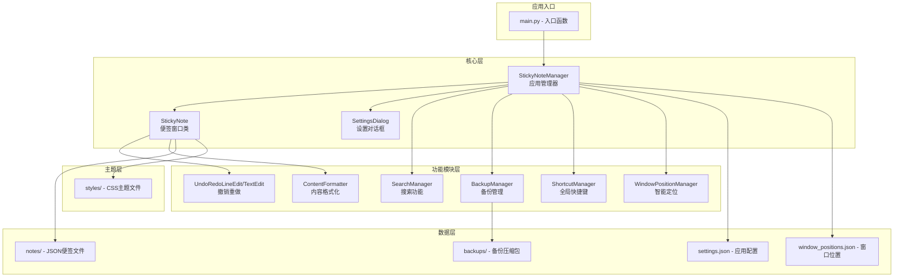

# 02 - 系统架构

## 整体架构

StickyNote 采用 **管理器模式（Manager Pattern）** 的桌面应用架构，以 `StickyNoteManager` 为核心控制器，统一管理便签实例、功能模块和系统资源。



## 目录结构

```
bianqian_windows/
├── main.py                      # 程序入口 (1802行)
│   ├── PlainLineEdit            #   纯文本单行编辑器
│   ├── PlainTextEdit            #   纯文本多行编辑器
│   ├── StickyNote               #   便签窗口类 (核心)
│   ├── SettingsDialog           #   设置对话框
│   └── StickyNoteManager        #   应用管理器 (核心)
│
├── core/                        # 核心模块目录 (预留)
│   └── __init__.py
│
├── features/                    # 功能模块目录
│   ├── __init__.py              #   模块元信息
│   ├── search.py                #   搜索功能 (SearchManager, SearchDialog)
│   ├── backup.py                #   备份管理 (BackupManager, BackupDialog)
│   ├── shortcuts.py             #   快捷键管理 (ShortcutManager)
│   ├── positioning.py           #   智能定位 (WindowPositionManager)
│   ├── undo_redo.py             #   撤销重做 (UndoRedoManager, UndoRedoLineEdit)
│   └── formatter.py             #   内容格式化 (ContentFormatter, SmartTextEdit)
│
├── styles/                      # 主题样式目录 (10个CSS文件)
│   ├── classic_white.css        #   经典白色
│   ├── elegant_green.css        #   优雅绿色
│   ├── fresh_blue.css           #   清新蓝色
│   ├── midnight_black.css       #   午夜黑色
│   ├── ocean_teal.css           #   海洋青色
│   ├── soft_yellow.css          #   柔和黄色 (默认)
│   ├── sunny_orange.css         #   阳光橙色
│   ├── sunset_orange.css        #   晚霞橙色
│   ├── vibrant_purple.css       #   活力紫色
│   └── warm_pink.css            #   温暖粉色
│
├── notes/                       # 便签数据目录 (运行时)
│   └── note_{id}.json           #   便签数据文件
│
├── backups/                     # 备份文件目录 (运行时)
│   ├── backup_settings.json     #   备份配置
│   └── stickynote_backup_*.zip  #   备份压缩包
│
├── settings.json                # 应用设置文件
├── window_positions.json        # 窗口位置记录
├── readme.md                    # 用户手册
├── PROJECT_SPECIFICATION.md     # 旧版项目规范
└── IMPROVEMENT_PLAN.md          # 旧版改进计划
```

## 核心模块关系

### StickyNoteManager（应用管理器）
- **职责**：应用程序生命周期管理、便签实例管理、功能模块初始化
- **持有**：
  - `notes: dict[int, StickyNote]` — 所有便签实例
  - `search_manager: SearchManager` — 搜索管理器
  - `shortcut_manager: ShortcutManager` — 快捷键管理器
  - `backup_manager: BackupManager` — 备份管理器
  - `tray_icon: QSystemTrayIcon` — 系统托盘
  - `settings_dialog: SettingsDialog` — 设置对话框

### StickyNote（便签窗口）
- **职责**：单个便签的 UI 展示和交互
- **持有**：
  - `title_edit: PlainLineEdit` — 标题编辑器
  - `text_edit: PlainTextEdit` — 内容编辑器
  - 字体控制按钮（A+/A-/B/I/A颜色）
  - 透明度滑块、置顶复选框
  - 格式化开关

## 数据流

### 启动流程
```
main() → StickyNoteManager.__init__()
    → 加载 settings.json
    → 初始化功能模块 (Search/Shortcut/Backup/Position)
    → 注册全局快捷键
    → 创建系统托盘
    → load_notes() — 遍历 notes/ 目录加载便签
    → 如无便签则 add_note() 创建默认便签
    → app.exec_() 进入事件循环
```

### 编辑保存流程
```
用户输入 → textChanged 信号
    → update_content() / update_title()
    → save_note() — 收集所有状态
    → 写入 notes/note_{id}.json
    → 更新托盘菜单标题
```

### 主题切换流程
```
SettingsDialog.on_theme_changed()
    → manager.set_default_theme(css_file)
    → manager.save_settings()
    → manager.apply_theme_to_all_notes()
    → 每个 StickyNote.set_theme(css_file)
        → apply_theme() — 读取CSS → setStyleSheet()
        → 检测深/浅色 → 自适应控件样式
        → 重新应用字体设置
```

### 搜索流程
```
Ctrl+Shift+F → SearchManager.show_search_dialog()
    → SearchDialog 输入关键词
    → perform_search() 遍历已打开便签 + 未打开JSON文件
    → 匹配标题/内容 → 显示结果列表
    → 双击打开便签（已打开则 raise，未打开则加载）
```

### 备份流程
```
自动: BackupManager.auto_backup_timer → auto_backup()
    → cleanup_old_backups() → create_backup()
手动: Ctrl+Shift+B → BackupDialog → create_backup()
    → BackupWorker (QThread) → create_backup_internal()
    → 压缩 notes/ + settings.json + styles/ → .zip
```

## 技术要点

### 无边框窗口 + 自定义交互
```python
flags = Qt.Window | Qt.FramelessWindowHint | Qt.Tool
```
通过 `mousePressEvent/mouseMoveEvent/mouseReleaseEvent` 实现自定义拖拽和8方向调整大小（`RESIZE_MARGIN = 10px`）。

### 全局快捷键
通过 `pywin32` 的 `RegisterHotKey` 注册系统级快捷键，使用 `HotkeyNativeEventFilter(QAbstractNativeEventFilter)` 拦截 `WM_HOTKEY` 原生消息并转发到 `GlobalShortcutManager.handle_hotkey_message()`，由 Qt 事件循环驱动，无需轮询。

### 信号槽通信
- `ShortcutManager.shortcut_activated` → `StickyNoteManager.handle_shortcut_activated`
- `QLineEdit.textChanged` / `QTextEdit.textChanged` → 自动保存
- `BackupWorker.backup_completed` → `BackupDialog.on_backup_completed`

### 线程安全
备份操作使用 `QThread`（`BackupWorker` / `RestoreWorker`）避免阻塞 UI，通过 `pyqtSignal` 跨线程通信。

---

*文档维护者: 开发团队*
*最后更新: 2026年6月*
